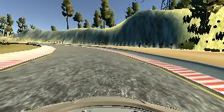
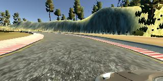
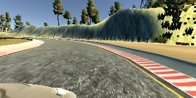
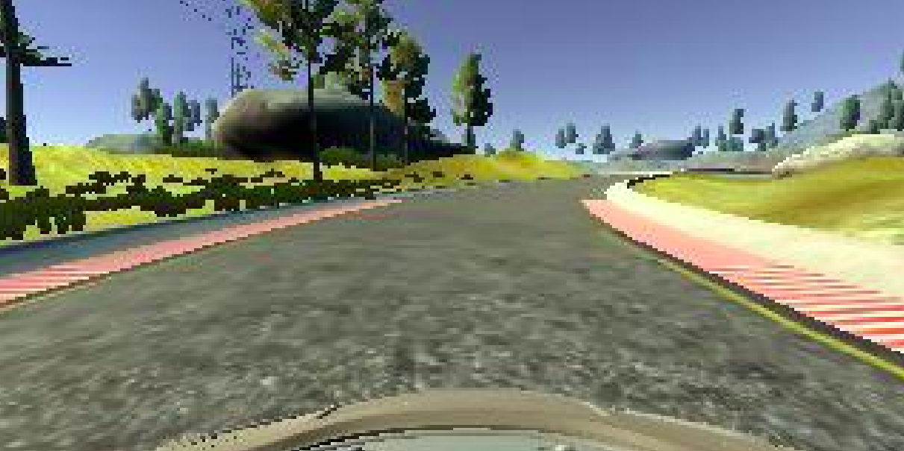
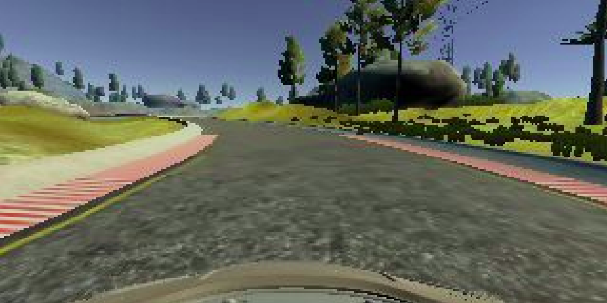
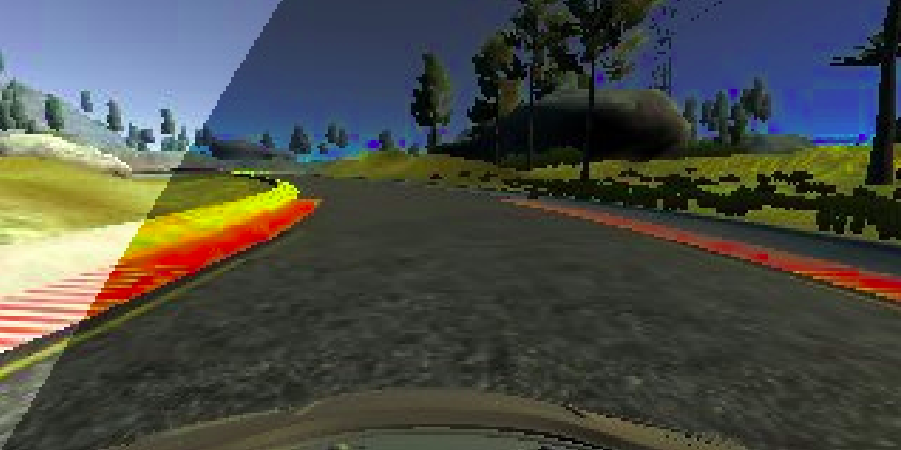
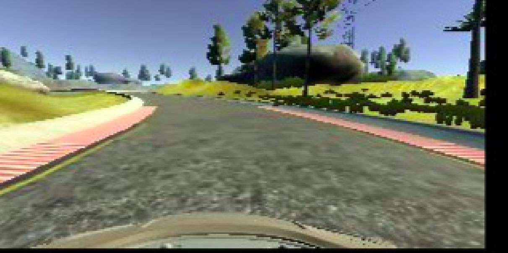
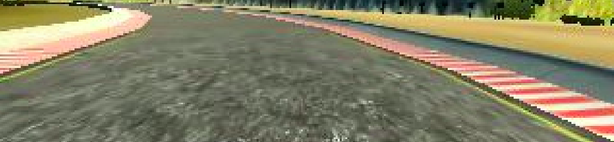

# Data Preprocessing (for Manual Data Collection Only)

## Table of Contents
1. **[Explanation](#explanation)**
2. **[Usage](#usage)**

## Explanation
- Original images from the car cameras are **320x160** pixels.

<div align="center">
    
</div>

- **Data augmentation** to increase the dataset for training:

   + **Step 1:** For center camera images, the steering angle is used as it is.

   + **Step 2:** For left camera images, the steering angle is increased by **0.2**.
    
    <div align="center">
        
        <br>
        <br>
    </div>
    
   + **Step 3:** For right camera images, the steering angle is decreased by **0.2**.
    
    <div align="center">
        
        <br>
        <br>
    </div>
    
   + **Step 4:** **Image augmentation**: Flip the images horizontally and reverse the steering angle sign.
    
    <div align="center">
        
        <br>
        <br>
    </div>
    
   + **Step 5:** Additional augmentations include image translation and brightness adjustments while maintaining the steering angle.
    
    <div align="center">
        
        <br>
        <em>Add brightness</em>
        <br>
        <br>
        
        <br>
        <em>Add darkness</em>
        <br>
        <br>
        
        <br>
        <em>Move</em>
        <br>
        <br>
    </div>

<br>
   
This process helps **avoid overfitting**, ensuring that the model generalizes well by having a larger variety of training data.

- **Note**: The car's front and the sky are not important for predicting the steering angle, so they are cropped out.
- Since we are using a CNN, all input images must be resized to the same dimensions, so images are reshaped to **66x200** pixels.

<div align="center">
    
</div>

<br>
<br>

## Usage

- Set input and output directories in `preprocessing.py` like below:
```python
# Path to unprocessed driving_log.csv
input_csv = 'data/raw/track1/driving_log.csv'

# Path to save processed data
output_csv = 'data/processed/track1/driving_log.csv'

# Path to save processed images
output_dir = 'data/processed/track1/IMG'
```

- Run `preprocessing.py`:
```bash
python preprocessing.py
```