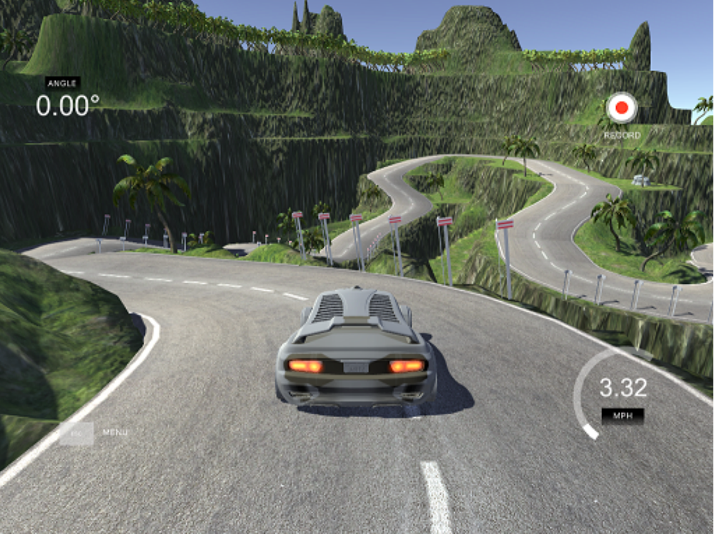
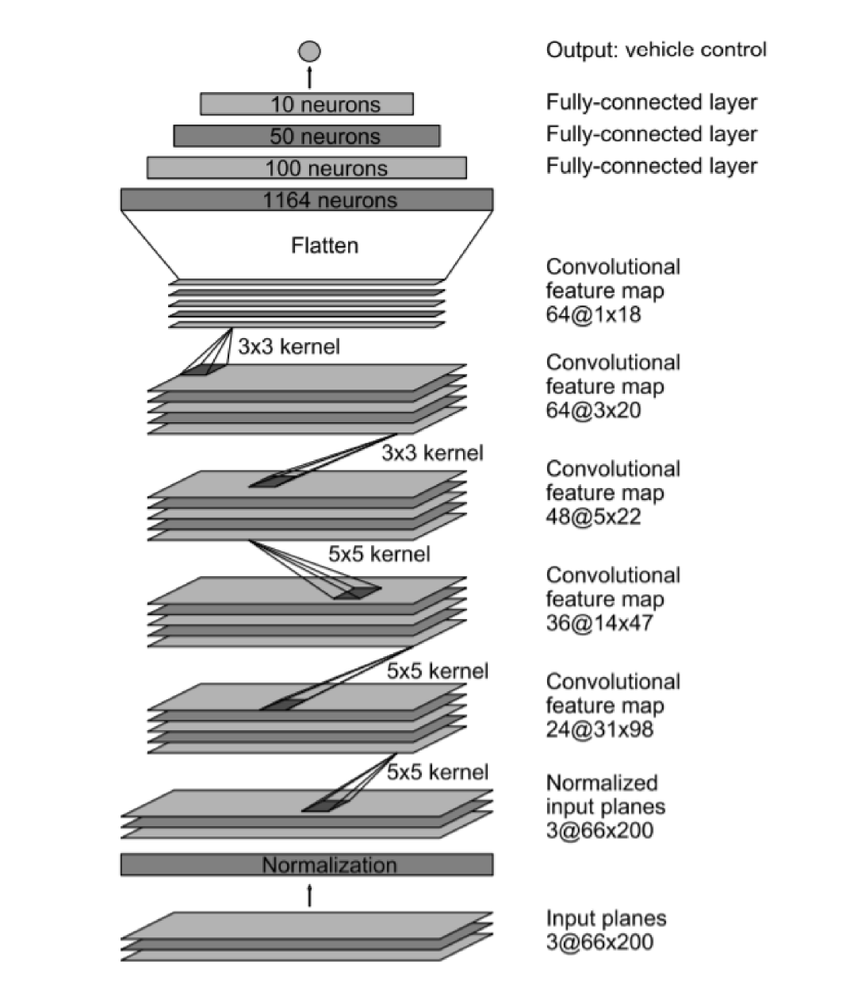

    <h1 align="center">🚗 Self-Driving Car Project 🚗</h1>
    

 
 

## Table of Contents
1. [Introduction](#introduction)
2. [Prerequisites](#prerequisites)
3. [Data Preparation](#data-preparation)
   - [Manual Data Collection](#manual-data-collection)
   - [Download Pre-recorded Data](#download-pre-recorded-data)
   - [Data Preprocessing](#data-preprocessing)
4. [Model Architecture](#model-architecture)
5. [Usage](#usage)

 
 

## Introduction

This deep learning model uses Convolutional Neural Networks (CNN) to predict steering angles and speed for the self-driving car simulation: [Udacity Self-Driving Car Simulator](https://github.com/udacity/self-driving-car-sim). The model takes input from the car's 3 cameras (left, center, and right) and makes predictions for the car's movement.

- **Car Movement**: The car can move left (←), right (→), accelerate (↑), and decelerate (↓).
- **Camera Setup**: The car is equipped with three cameras (left, center, right).

 
 

## Prerequisites

- **Operating System**: Linux or Windows (Linux preferred)
- **Python**: 3.12.7
- **Simulation App**: [Udacity Self-Driving Car Simulator](https://github.com/udacity/self-driving-car-sim)

 
 

## Data Preparation

### Manual Data Collection:
1. Open the simulator and select the **Training Mode**.

    

2. Click on **Record**, choose a folder to save the data, and drive the car for about **10 minutes**.
   - Driving for 10 minutes will yield around **18,000 images** (6,000 images from each camera).

### Download Pre-recorded Data:
- **[Coming Soon]**

 

After data collection, you will have a `driving_log.csv` file, which contains information about the collected data:

| Image Path | Center Camera Image | Left Camera Image | Right Camera Image | Steering Angle | Throttle | Brake |
|------------|---------------------|-------------------|--------------------|----------------|----------|-------|

 
 

### Data Preprocessing
For Manual Data Collection Only.

Follow [**Data Preprocessing**](DataPreprocessing.md)

 
 

## Model Architecture

    

 
 

## Usage

### [Coming Soon]

Once the model is trained, you can use it to predict the car's movements based on the camera input in the simulator.
